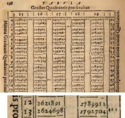

PROJECT RUBRIC ***ITE 19 – Final Project*** 

Faculty: **DEXTER A. ROMAGUERA** 

Course Description: **ITE Competency Appraisal** Course Code: **ITE 19** 

Term/SY/Term: **Final** - **2024 – 2025, 1st Semester **

**Project Title:** *Roman Numeral System to Decimal Numbers in Words* __Submission and Evaluation Date: *(INDIVIDUAL) Starting December 16, 2024*__* __Deadline: *December 26, 2024.*__ 

**Roman Numeral and** 

**Decimal Number System Overview** 

*Click on the image to view source* 

In the ancient city of Rome, where gladiators fought and emperors  ruled, there was a peculiar system for keeping track of everything— from  grain  supplies  to  victorious  conquests.  This  system  was  the  

**Roman numeral system**, a method of counting that tells  a tale of innovation, simplicity, and endurance.  

Long before the Romans rose to power, numbers were needed for  trade and governance. Borrowing inspiration from earlier civilizations  like the Etruscans, the Romans developed their own numbering system. It was designed to be straightforward, requiring no complicated calculations—perfect for a society of traders, soldiers, and engineers. 

The Romans used letters to represent numbers: 

- **I** for 1, 
- **V** for 5, 
- **X** for 10, 
- **L** for 50, 
- **C** for 100, 
- **D** for 500, 
- **M** for 1,000. 

These symbols, carved into stone or written on parchment, were easily recognized and universally understood across the Roman Empire. 

The Roman numeral system was additive and subtractive: 

- To create numbers like **3**, they added: **III** (1 + 1 + 1). 
- For numbers like **4**, they subtracted: **IV** (5 - 1). 
- Larger numbers combined these principles, such as **XIV** for 14 (10 + 4). 

  This system had no concept of zero, as the Romans didn't find it practical. They preferred tangible numbers that reflected actual things—zero, being nothing, seemed unnecessary. 

Roman numerals remind us of a time when innovation met the needs of a growing empire. They are a symbol of human ingenuity—proof that even the simplest tools can shape history. 

In every **IV**, **X**, or **MCMLXXIV**, there lies a story of a civilization that once ruled the world. These numbers continue to inspire, connecting us to the ancient past in  ways both practical and profound.  

The shift from the Roman numeral system to  the decimal (or Hindu-Arabic) numeral system  was one of the most transformative events in  the  history  of  mathematics.  It  marked  the  evolution of human thinking about numbers,  calculations, and record-keeping, paving the  way  for  modern  science,  commerce,  and  technology.  

Roman numerals served the Roman Empire well, but as society became more complex, their limitations became evident: 

1. **No Place Value**: Roman numerals lacked the concept of place value (e.g., the "1" in 10 vs. 100). Each symbol stood alone, making large numbers unwieldy. 
1. **No Zero**: Without a representation for zero, mathematical calculations and the concept of nothingness were difficult to express. 
1. **Limited Calculations**: Addition and subtraction were manageable, but multiplication and division were cumbersome. 
1. **Clunky for Large Numbers**: Representing large or complex numbers required long strings of symbols, making them impractical for advanced calculations. 

The **Decimal System**, also known as the Hindu-Arabic numeral system, originated in India around the 3rd century CE and was later refined by Persian and Arab mathematicians. It introduced: 

- **Digits 0 through 9**: A simple and universal way to represent any number. 
- **Place Value**: The position of a digit determined its value (e.g., 3 in 30 is ten times greater than 3 in 3). 
- **Zero**: A revolutionary concept that allowed for more complex calculations and a true representation of "nothing." 

The transition was not immediate. Many Europeans were hesitant to abandon Roman numerals, which had been used for centuries. Reasons for resistance included:  

- **Tradition**: Roman numerals were deeply ingrained in cultural  and official practices.  
- **Suspicion of Arabic Influence**: In medieval Europe, anything  associated with the Arab world was sometimes viewed with  skepticism.  
- **Practical  Challenges**:  Clerks,  scribes,  and  merchants  had  to  relearn their systems.  

However, as trade expanded and the need for efficient calculations  grew, the advantages of the decimal system became undeniable.  

By the 15th century, the decimal system was widely adopted in Europe:  

- **Printing Press**: The invention of the printing press in the mid-15th century helped spread knowledge of the decimal system. 
- **Scientific  Revolution**:  The  decimal  system  became  essential  for  advancements  in  mathematics, astronomy, and engineering. 
- **Commerce**: The simplicity of calculations with decimal numbers made it the standard for accounting and trade. 

**Project Instructions:** 

With the advent of the Hindu-Arabic numeral system, decimal numbers (0–9) became the standard worldwide due to their simplicity and support for advanced calculations. As programmers in the modern era, your task is to bridge the past and present by writing a C program that *converts* **Basic or Continuous Roman numerals** to their decimal equivalents in *word format*. Consider using a file as an input and output of your running program. *Avoid using pre-defined functions in the program implementations*.  

Rules in converting Roman Numeral numbers to its decimal equivalent: 

**Roman numerals use combinations of seven symbols:** I = 1, V = 5, X = 10, L = 50, C = 100, D = 500, M = 1000 

- Symbols are added if they appear in descending order (e.g., **VI = 5 + 1 = 6**). 
- A smaller value before a larger value means subtraction (e.g., **IV = 5 - 1 = 4**). 

**Algorithm to Convert Roman to Decimal** 

1. Start with a total set to 0. 
1. Iterate through the Roman numeral string from left to right. 
1. For each symbol: 
   1. If its value is less than the value of the next symbol, subtract it from the total. 
   1. Otherwise, add it to the total. 
1. Return the total. 

**Example:** 

Convert "**MCMXCIV**" to Decimal: 

1. M (1000): Add 1000 → total = 1000. 
1. C (100): Add 100 → total = 1100. 
1. M (1000): Subtract 100 (since 100 < 1000) → total = 1900. 
1. X (10): Add 10 → total = 1910. 
1. C (100): Subtract 10 (since 10 < 100) → total = 1990. 
1. I (1): Add 1 → total = 1991. 
1. V (5): Subtract 1 (since 1 < 5) → total = 1994. 

Result: **1994**. 

**Program Test Example:** 

Input.txt 

MCMXCIV    +   MMXXIV 

DCCC   -   MMMCMXCIX MMCDLXXVII   **\***   MMMDCCCLXXXVIII 

Process: 

1994    +   2024   =   4018 800   -   3999  =   4799 2477   \*   3888  =  6365 

*Arithmetic symbols will determine the total/equal decimal value of all roman numerals in a single line.* Output.txt 

Four Thousand Eighteen 

Four Thousand Seven Hundred Ninety Nine Six Thousand Three Hundred Sixty Five 

**Important things to note:** During submission, your program will be tested with other arithmetic symbols and more Roman numeral numbers. Include preventive mechanisms ignoring non-roman numeral and arithmetic symbols during program run-time.  

**Requirements:** 

- Five (5) or more user-defined functions (include one or more parameterized function) 
- Arrays and Loops 
- Control Statements like IF-ELSE or Switch 
- Pointers (optional) 
- Comments for all lines of codes 

**Submission:** 

Prepare a minimum of 5 minute and a maximum of 10 minute video presentation of your code and program output. Include a GitHub or GitLab repository of your code and please avoid sharing it with your classmates or other people (though it’s a public repo). Please bring a laptop and present yourself (F2F Presentation is required) and your running program in my office located on the 1st floor of Hiraya Hall/CCIS building, CIPC Office. Please prepare a valid reason with attachments for those students who cannot present in person.  

**Note:** **Failure to follow the instructions will result in the submission not being recorded or point deductions.**  Refer to the *Rubric Table* below for the criteria of this Project. 

**Rubric Table:** 

|Criteria |Excellent 6 |Very Good 5** |Satisfactory 4** |Needs Improvement 3** |No code Presented 0** |**Total Score**|
| - | :-: | :-: | :-: | :-: | :-: | - |
|Project Instructions |Followed all project instructions. |Failure to follow one (1) of project instructions. |Failure to follow two (2) of project instructions. |Failure to follow three (3) of project instructions. |Unable to follow all project instructions. ||
|Application Requirements |Demonstrated superior knowledge in the development and |Completed and implemented the project based on the listed features and requirements. |Implemented the project yet missed one (1) feature and requirement. |Implemented the project yet missed two (2) features and requirements. |Implemented the project without at least one concept from ||
||implementation of the project features and requirements. ||||the listed requirements. ||
| :- | :- | :- | :- | :- | :- | :- |
|
Presentation 

￿ Video 

presentation and documentation 
|
￿  100% of the 

application and code was presented and documented. 
|
￿  90% of the 

application and code was presented and documented. 
|
￿  70% of the 

application and code was presented and documented.
|
￿  50% of the 

application and code was presented and documented 
|No application and code presented. ||
|**Total** |18 |15 |12 |9 |0 ||

